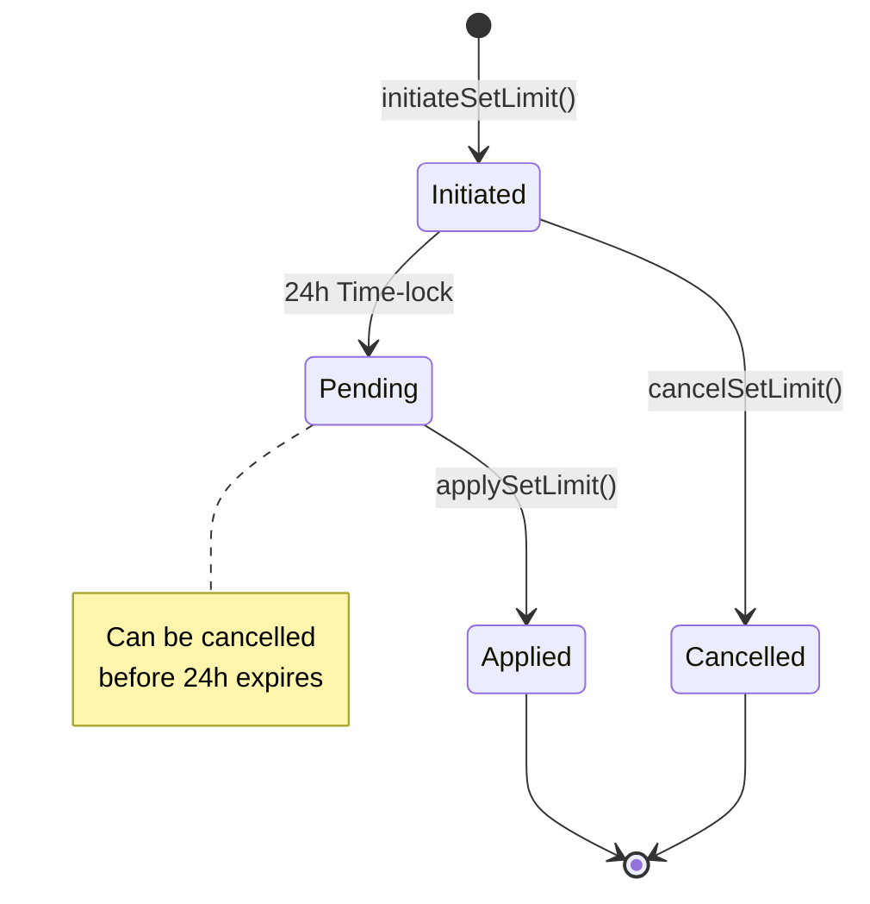

# DailyERC20SpendingLimitHook

The `DailyERC20SpendingLimitHook` implements a daily spending limit mechanism for Elytro wallets. This hook enables users to set daily spending limits for both ETH and ERC20 tokens, providing an additional layer of security by preventing excessive spending within a 24-hour period. The spending limits reset at the start of each UTC day, and any changes to these limits are subject to a time-lock period.

## Key Features

- Daily spending limits for ETH and ERC20 tokens
- Natural day-based reset (UTC timezone)
- Time-locked limit changes
- Support for multiple tokens

## Spending Limit Flow

1. **Initial Setup**: Users configure initial spending limits for their desired tokens when installing the hook

2. **Transaction Validation**: The hook validates every transaction against the daily limits:

   - Checks if the transaction would exceed the daily limit
   - Automatically resets limits at the start of each UTC day
   - Supports both direct ETH transfers and ERC20 token transfers

3. **Limit Changes**: Users can modify spending limits through a time-locked process:
   - `initiateSetLimit`: Initiates the process of changing a token's limit
   - `applySetLimit`: Applies the new limit after the time-lock period (24 hours)
   - `cancelSetLimit`: Cancels a pending limit change before it takes effect

## Time-lock Process for Changing Limits



## Considerations

- Spending limits reset at UTC midnight (00:00 UTC)
- Limit changes require a 24-hour waiting period for security
- Tokens with zero limits have unlimited spending
- Supports common ERC20 operations (transfer, transferFrom, approve)

## Security Features

- Time-locked limit changes prevent immediate limit modifications
- Natural day resets provide predictable spending windows
- Separate limits for each token
- Transparent limit tracking and remaining allowance queries

## Usage Example

```solidity
// Initialize hook with ETH and USDC limits
address private constant ETH_TOKEN_ADDRESS = address(2);
address[] memory tokens = new address[](2);
tokens[0] = ETH_TOKEN_ADDRESS;  // Special address for ETH
tokens[1] = USDC_ADDRESS;       // USDC token address

uint256[] memory limits = new uint256[](2);
limits[0] = 1 ether;           // 1 ETH daily limit
limits[1] = 1000 * 10**6;      // 1000 USDC daily limit

bytes memory initData = abi.encode(tokens, limits);
// Install hook with initData
bytes[] memory hooks = new bytes[](1);
uint8 capabilityFlags = 2; // preUserOpValidationHook only
hooks[0] = abi.encodePacked(address(dailyLimitHook), initData, capabilityFlags);
```
