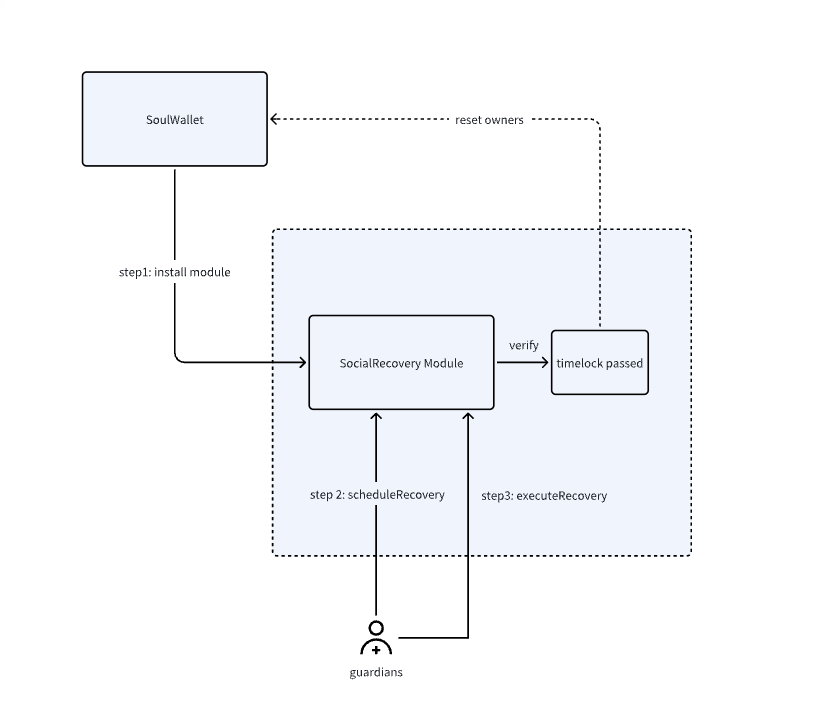

# SocialRecoveryModule

The `SocialRecoveryModule` is a Solidity contract that can be installed in wallets to enable a social recovery mechanism. This module allows a user to designate a list of guardians for their wallet and establish a recovery threshold. If a wallet is lost or compromised, the guardians can initiate a recovery process by signing a special EIP712 signature. However, this recovery process is subject to a user-defined time lock period, and the guardians can only execute the recovery after this period has passed. This mechanism ensures that the user's assets remain secure and recoverable, even in unforeseen circumstances.

## Recovery flow



- Step 1: Users install the Social Recovery Module in their Elytro. They need to configure the guardian hash and the execution delay period when installing the module. The guardian hash refers to the keccak256 hash of the GuardianData, ensuring the privacy of guardian identities. Others cannot check your guardians' settings on-chain and they are only revealed when the user initiates the social recovery process.

  ```solidity
    struct GuardianData {
          address[] guardians;
          uint256 threshold;
          uint256 salt;
      }
  ```

- Step 2: When users want to recover their wallet using the guardians, they have to contact the guardians to sign an EIP-712 based signature and use the following scheme:

  - EIP712Domain

  ```json
  {
    "EIP712Domain": [
      { "type": "uint256", "name": "chainId" },
      { "type": "address", "name": "SocialRecovery" }
    ]
  }
  ```

  - SocialRecovery

  ```json
  {
    "SocialRecovery": [
      { "type": "address", "name": "wallet" },
      { "type": "uint256", "name": "nonce" },
      { "type": "bytes32[]", "name": "newOwners" }
    ]
  }
  ```

  Once the signatures are collected and the threshold is met, it can call scheduleRecovery to enter the waiting queue for recovery.

- Step 3: If the timelock period has passed, one can call `executeRecovery` to perform the recovery. The social recovery module will then reset the owners based on the previous setting.

## Considerations

- Users can call `cancelAllRecovery` to invalidate transactions in the pending queue.
- Users can call `setGuardian` to change guardians' settings without a timelock.
